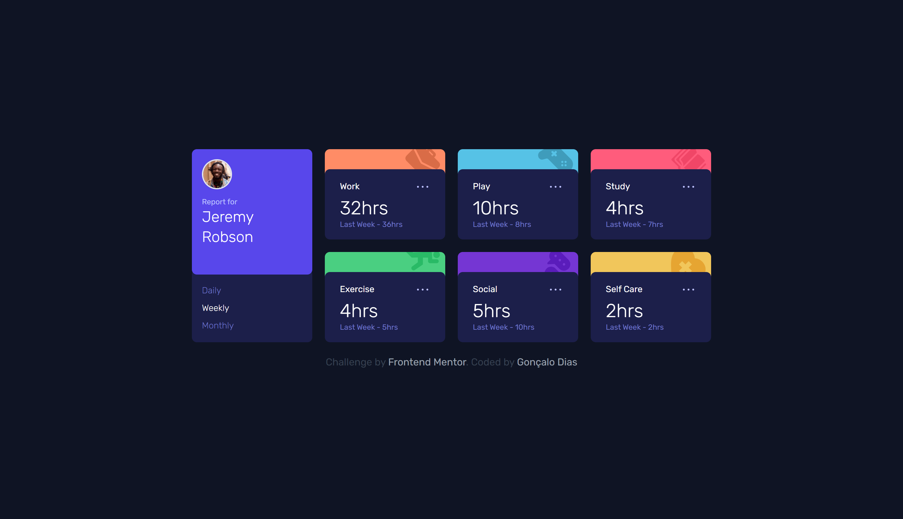

# Frontend Mentor - Time tracking dashboard solution

This is a solution to the [Time tracking dashboard challenge on Frontend Mentor](https://www.frontendmentor.io/challenges/time-tracking-dashboard-UIQ7167Jw).

## Table of contents

- [Overview](#overview)
  - [The challenge](#the-challenge)
  - [Screenshot](#screenshot)
  - [Links](#links)
- [My process](#my-process)
  - [Built with](#built-with)
  - [What I learned](#what-i-learned)
  - [Continued development](#continued-development)
- [Author](#author)
- [Acknowledgments](#acknowledgments)

## Overview

### The challenge

Users should be able to:

- View the optimal layout for the site depending on their device's screen size
- See hover states for all interactive elements on the page
- Switch between viewing Daily, Weekly, and Monthly stats

### Screenshot



### Links

- [Live Site](https://time-tracking-dashboard-one.vercel.app)

## My process

### Built with

- [Next.js](https://nextjs.org/) - React framework
- [TailwindCSS](https://tailwindcss.com/) - For styling
- Semantic HTML5 markup
- Flexbox
- CSS Grid
- Mobile-first workflow

### What I learned

This was an important project to understand better state in React, specifically how to toggle between multiple states. In this case, I managed to change the stats timeframe (Daily, Weekly, Monthly) based on the option selected in the main card.

```jsx
const [timeframe, setTimeframe] = useState('weekly')
let text =
  timeframe === 'daily'
    ? 'Yesterday'
    : timeframe === 'weekly'
    ? 'Last Week'
    : timeframe === 'monthly'
    ? 'Last Month'
    : ''
```

```jsx
<ul className='flex items-center md:flex-col md:items-start md:gap-2 justify-between'>
  {['daily', 'weekly', 'monthly'].map((time) => (
    <li
      id={time}
      onClick={(e) => setTimeframe(e.target.id)}
      className={`cursor-pointer capitalize ${
        time === timeframe && 'text-white'
      }`}
    >
      {time}
    </li>
  ))}
</ul>
```

This was also a great opportunity to improve my ability to fetch data from a local JSON file, as well as practicing CSS layouts (Flexbox and Grid)

### Continued development

I am still working on understanding state management in React, and I plan on learning further about this in the future. I feel very comfortable with styling, however I often struggle with logic and adding functionality to the project. I will definitely work on improving this weaker area of mine.

## Author

- Github - [Gonçalo Dias](https://github.com/goncalodiasmm)
- Frontend Mentor - [@goncalodiasmm](https://www.frontendmentor.io/profile/goncalodiasmm)
- Twitter - [@goncalodiasmm](https://twitter.com/goncalodiasmm)

## Acknowledgments

[This solution](https://github.com/jm-freitas/time-tracking-dashboard) from Jonatas Freitas helped me undestanding the logic of toggling between multiple states in React. Thank you Jonatas! 
